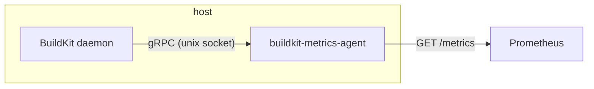

# BuildKit reporting agent

Rust sidecar that connects to BuildKit over its gRPC socket and exposes **status metrics** (workers, cache, version) on a Prometheus scrape endpoint. Uses only the Control API (Info, ListWorkers, DiskUsage)—no full BuildKit client.



## Dev setup

- **Nix (recommended):** `nix develop` then use `cargo` / `make` as below.
- **Otherwise:** Rust 1.70+, `cargo` in PATH.

Regenerate proto-derived code after changing `.proto` files:

```bash
make generate   # writes src/generated/
```

Then build and run:

```bash
cargo build --release
cargo run --release --   # or: make run
```

Config (env or flags): `BUILDKIT_ADDR` (default `unix:///run/buildkit/buildkitd.sock`), `METRICS_ADDR` (default `0.0.0.0:9090`), `SCRAPE_INTERVAL_SECS` (default `15`).

## Image build

Generated code must exist in `src/generated/` (run `make generate` and commit, or run codegen in CI before `docker build`). The Dockerfile is multi-arch: it builds for the target platform (linux/amd64 or linux/arm64) via BuildKit `TARGETPLATFORM`.

Single arch (current host):

```bash
docker build -t buildkit-metrics-agent .
```

Both linux/amd64 and linux/arm64 (manifest list):

```bash
docker buildx build --platform linux/amd64,linux/arm64 -t buildkit-metrics-agent .
# or: make docker-multi
```

## Kubernetes

Deploy as a sidecar next to BuildKit using the provided example:

```bash
kubectl apply -f examples/kubernetes.yaml
```

See [`examples/kubernetes.yaml`](examples/kubernetes.yaml) for the full Pod + Service manifest.

Scrape `http://<pod-ip>:9090/metrics` or use the `buildkit-metrics-agent` Service for in-cluster Prometheus scraping.
