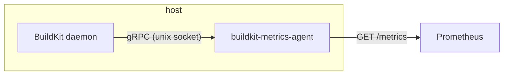

# BuildKit Metrics Agent

Lightweight Rust application that scrapes and exposes BuildKit metrics.


```mermaid
flowchart LR
  subgraph host
    BK[BuildKit daemon]
    A[buildkit-metrics-agent]
  end
  BK -->|"gRPC (unix socket)"| A
  A -->|"GET /metrics"| P[Prometheus]
```

## Metrics

| Metric                               | Type      | Labels                | Description                              |
| ------------------------------------ | --------- | --------------------- | ---------------------------------------- |
| `buildkit_info`                      | gauge     | `version`, `revision` | BuildKit version info (always `1`)       |
| `buildkit_workers_total`             | gauge     |                       | Number of active workers                 |
| `buildkit_cache_records_total`       | gauge     |                       | Number of cache records                  |
| `buildkit_cache_size_bytes`          | gauge     |                       | Total cache size in bytes                |
| `buildkit_cache_size_by_type_bytes`  | gauge     | `record_type`         | Cache size in bytes by record type       |
| `buildkit_builds_total`              | counter   |                       | Total builds observed                    |
| `buildkit_builds_succeeded_total`    | counter   |                       | Builds that completed successfully       |
| `buildkit_builds_failed_total`       | counter   |                       | Builds that failed                       |
| `buildkit_builds_cached_steps_total` | counter   |                       | Total cache-hit build steps              |
| `buildkit_builds_total_steps_total`  | counter   |                       | Total build steps                        |
| `buildkit_build_duration_seconds`    | histogram |                       | Build duration from created to completed |

## Grafana

A pre-built dashboard is provided at `[examples/grafana/buildkit-metrics-dashboard.json](examples/grafana/buildkit-metrics-dashboard.json)`.

**Import:** In Grafana, go to **Dashboards → Import**, upload the JSON file, and select your Prometheus datasource when prompted.

The dashboard includes:

- **Overview stats** — total builds, succeeded, failed, and success rate over the selected time range; current cache size and worker count.
- **Rates & trends** — build and failure rate over time; step throughput broken down by total vs. cache-hit steps.
- **Per-pod breakdown** — top-K pods ranked by builds, failures, cache size, and cached steps; a summary table with all key metrics per pod.
- **Cache breakdown** — cache size by type over time.

Filters for **namespace**, **pod**, and **top-K** limit are available as dashboard variables.

## Dev setup

- **Nix (recommended):** `nix develop` then use `cargo` / `make` as below.
- **Otherwise:** Rust 1.70+, `cargo` in PATH.

Regenerate proto-derived code after changing `.proto` files:

```bash
make generate   # writes src/generated/
```

Then build and run:

```bash
cargo build --release
cargo run --release --   # or: make run
```

Config (env or flags): `BUILDKIT_ADDR` (default `unix:///run/buildkit/buildkitd.sock`), `METRICS_ADDR` (default `0.0.0.0:9090`), `SCRAPE_INTERVAL_SECS` (default `15`).

## Image build

Generated code must exist in `src/generated/` (run `make generate` and commit, or run codegen in CI before `docker build`). The Dockerfile is multi-arch: it builds for the target platform (linux/amd64 or linux/arm64) via BuildKit `TARGETPLATFORM`.

Single arch (current host):

```bash
docker build -t buildkit-metrics-agent .
```

Both linux/amd64 and linux/arm64 (manifest list):

```bash
docker buildx build --platform linux/amd64,linux/arm64 -t buildkit-metrics-agent .
# or: make docker-multi
```

## Kubernetes

Deploy as a sidecar next to BuildKit using the provided example:

```bash
kubectl apply -f 'examples/kubernetes/rootless+service.yaml'
```

See `[examples/kubernetes/rootless+service.yaml](examples/kubernetes/rootless+service.yaml)` for the full Pod + Service manifest.

Scrape `http://<pod-ip>:9090/metrics` or use the `buildkit-metrics-agent` Service for in-cluster Prometheus scraping.
